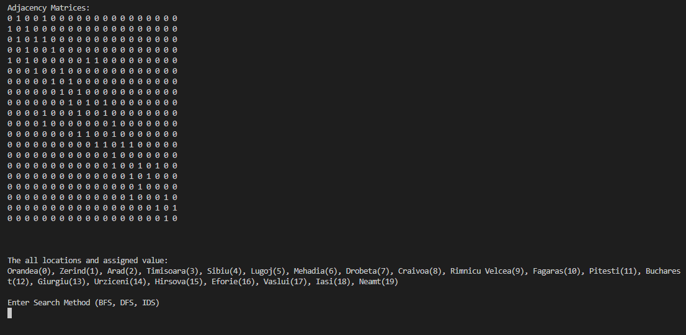
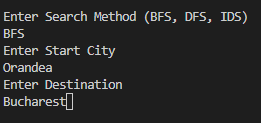
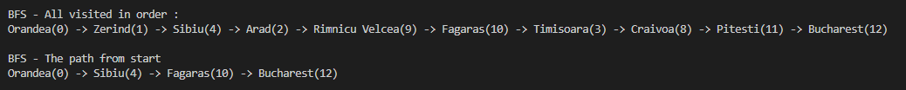
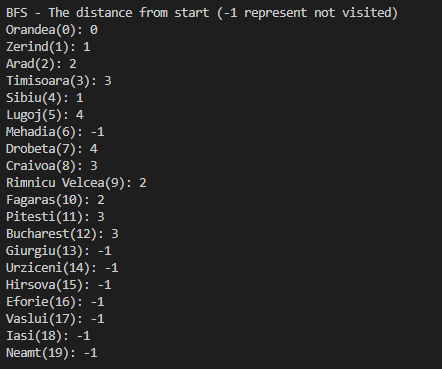

# Project Description
This program allows you to try 3 Searching Algorithms

* Breadth-First Search (BFS)
* Depth-First Search (DFS)
* Iterative-Deepening Search (IDS)

There's 2 traditional way been used to implement these searching algorithms: 1. Recussive function 2. While Loop and this program is impremented by While loop. The reason I used 2nd method is that for the easiness of mangaging the code and implementation. 

# How to Compile and Run the Project

1. Download the project in your local environment
2. In Terminal, go to the directory where your cource code is located
3. Compile your all the files with java extention by command "javac *.java"
4. Run the main file by command "java Main"

# User Interface
1. Once the Program runs correctly, it shows the *Adjacency Matrices* and The all location with assigned value

2. The program is going to ask which Algorithm you want to use for search, the starting location, and final destination. Make sure to enter the names with all string instead of numbers

3. After you hit Enter key, it'll show you the all visited locations and the shortest path that it finds based on the search algorithms you have chosen

*Adjacency Matrices* - represent relationship of the connecting vertex

# Extra Functionarity 

1. This program provides an output file with the Adjacency Matrices. It's initially generates one in Main.java but you could also add one line of code "File_Handler.write_to_txtFile(Graph.adjMat);".

2. If you wish to see the all visited locations with the distance from Start point, you could add line of code "Algorithms.print_distances(algo);". Note that -1 represent non visited location.
