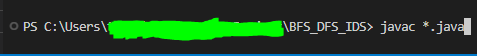

# BFS_DFS_IDS

[Project Description: This program allows you to try 3 Searching Algorithms]

* Breadth-First Search (BFS)
* Depth-First Search (DFS)
* Iterative-Deepening Search (IDS)

There's 2 traditional way been used to implement these searching algorithms: 1. Recussive function 2. While Loop and this program is impremented by While loop. The reason I used 2nd method is that for the easiness of mangaging the code and implementation. 

[How to Install and Run the Project]

1. Download the project in your local environment
2. In Terminal, go to the directory where your cource code is located
3. Compile your all the files with java extention by command "javac *.java"
4. Run the main file by command "java Main"

